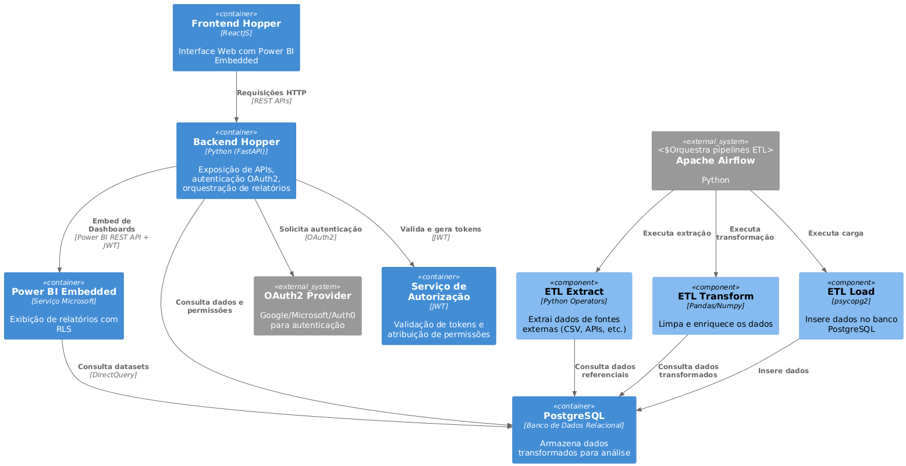

 

  

 

- **Título do Projeto**: Sistema de Gerenciamento e Distribuição de Relatórios Dinâmicos com Power BI Embedded.
- **Nome do Estudante**: Gabriel Deglmann Kasten.
- **Curso**: Engenharia de Software.
- **Data de Entrega**: [Data].

---

## Resumo

Em ambientes corporativos que lidam com grandes volumes de dados, equipes de negócios enfrentam atrasos e inconsistências ao consolidar e analisar informações manualmente. O Hopper surge para resolver esse problema, oferecendo uma plataforma que automatiza o fluxo de ETL, centralizando e padronizando a preparação de dados e disponibilizando dashboards interativos via Power BI Embedded, garantindo relatórios sempre atualizados, seguros e escaláveis para suportar decisões estratégicas.

## 1. Introdução

A construção de um sistema como o Hopper se justifica pela necessidade crescente de automatizar e padronizar o tratamento de dados em empresas que buscam agilidade, confiabilidade e segurança na geração de relatórios. Soluções manuais são propensas a erros, dificultam a escalabilidade e aumentam o risco de exposição de informações sensíveis. Ao centralizar o gerenciamento de pipelines ETL usando o Apache Airflow e a distribuição de dashboards com o Power BI Embedded, o Hopper reduz custos operacionais, melhora a governança de dados e permite que as equipes foquem na análise estratégica, em vez de tarefas repetitivas e suscetíveis a falhas.

O Apache Airflow é uma plataforma open source de orquestração de workflows, projetada para programar, monitorar e gerenciar pipelines de dados complexos de forma programática e escalável. Utilizando DAGs (Directed Acyclic Graphs), o Airflow permite a definição explícita de dependências, agendamento e execução de tarefas, além de oferecer integração nativa com diversos sistemas de armazenamento, bancos de dados e serviços em nuvem. Sua arquitetura modular e extensível facilita a automação de processos ETL, garantindo rastreabilidade, reprocessamento eficiente e monitoramento detalhado das execuções, aspectos essenciais para ambientes corporativos que demandam alta confiabilidade e auditabilidade no tratamento de dados.

O Power BI Embedded é um serviço da Microsoft Azure que permite incorporar dashboards e relatórios interativos do Power BI diretamente em aplicações web ou portais internos de empresas. Diferente do Power BI tradicional, que é acessado via portal próprio, o Embedded oferece APIs e SDKs para que desenvolvedores possam integrar visualizações de dados personalizadas e seguras em suas próprias soluções, proporcionando uma experiência de análise de dados fluida para os usuários finais, sem a necessidade de alternar entre diferentes plataformas. Isso facilita o acesso a informações estratégicas, mantendo o controle de acesso e a segurança dos dados conforme as necessidades do negócio.

**Objetivos**

O projeto visa criar uma plataforma capaz de automatizar todo o fluxo de ETL (Extração, Transformação e Carga de dados), eliminando tarefas manuais e reduzindo erros no tratamento de informações. Além disso, busca disponibilizar dashboards interativos utilizando o Power BI Embedded, permitindo que usuários acessem relatórios atualizados e visualizações dinâmicas diretamente pela aplicação, sem depender de múltiplas ferramentas ou processos manuais.

Entre os objetivos complementares, destaca-se a implementação de um controle de acesso granular, garantindo que cada usuário visualize apenas os dados pertinentes ao seu perfil ou função. O sistema também irá monitorar métricas de execução dos pipelines e relatórios, fornecendo indicadores de desempenho e alertas para possíveis falhas ou gargalos. Por fim, será possível gerenciar relatórios de forma centralizada, facilitando o upload, atualização e organização dos dashboards dentro da plataforma.

## 2. Descrição do Projeto
- **Tema do Projeto**: Desenvolvimento de uma plataforma de gerenciamento e distribuição de relatórios dinâmicos, chamada Hopper, que automatiza o processo de ETL e utiliza o Power BI Embedded para visualização de dados.

- **Problemas a Resolver**:
  - Atrasos e inconsistências na consolidação e análise manual de dados.
  - Gargalos de eficiência em processos de ETL.
  - Riscos de segurança na distribuição de relatórios.
  - Falta de relatórios atualizado para decisões estratégicas.
  
- **Limitações**: O projeto não abordará a criação de visualizações customizadas além das capacidades do Power BI, nem o desenvolvimento de algoritmos de machine learning para análise preditiva. A gestão de infraestrutura de hardware subjacente fica a cargo dos serviços de nuvem (Render.com).

## 3. Especificação Técnica

Descrição detalhada da proposta, incluindo requisitos de software, protocolos, algoritmos, procedimentos, formatos de dados, etc.

### 3.1. Requisitos de Software

- **Lista de Requisitos:**

  - **Requisitos Funcionais (RF):**
    - **RF01:** O sistema deve permitir a configuração de pipelines ETL.
    - **RF02:** O sistema deve permitir a execução automatizada de pipelines.
    - **RF03:** O sistema deve extrair dados de múltiplas fontes.
    - **RF04:** O sistema deve transformar dados.
    - **RF05:** O sistema deve realizar carga incremental de dados no banco.
    - **RF06:** O sistema deve permitir autenticação de usuários.
    - **RF07:** O sistema deve aplicar regras de segurança em nível de linha.
    - **RF08:** O sistema deve permitir upload e gerenciamento de relatórios.
    - **RF09:** O sistema deve ser capaz de publicar dashboards.
    - **RF10:** O sistema deve permitir atualização programada dos relatórios.
    - **RF12:** O sistema deve monitorar métricas de execução.
    - **RF13:** O sistema deve permitir gerenciamento de relatórios.

  - **Requisitos Não Funcionais (RNF):**
    - **RNF01:** O sistema deve definir cargos (Admin, Analista, Visualizador) e integrar com provedores OAuth2.
    - **RNF02:** O sistema deve garantir tempo máximo de execução de 5 minutos para os pipelines.
    - **RNF03:** O sistema deve criptografar dados em trânsito (TLS 1.3) e em repouso (AES-256).
    - **RNF04:** O sistema deve ser implantado com auto-scaling horizontal e balanceamento de carga.
    - **RNF05:** O sistema deve gerar logs de auditoria centralizados.
    - **RNF06:** O sistema deve utilizar operadores customizados em Python para ETL.
    - **RNF07:** O sistema deve integrar-se à Power BI REST API para automação.
    - **RNF08:** O sistema deve utilizar tokens JWT no backend para autorização.
    - **RNF09:** O sistema deve utilizar a biblioteca powerbi-client-react no frontend para embed seguro.

### **Representação dos Requisitos:**

  

### 3.2. Considerações de Design
- **Visão Inicial da Arquitetura**:
  - **Camada ETL:** Airflow foi escolhido por sua robustez e flexibilidade na orquestração de pipelines de dados, facilitando automação e monitoramento.
  - **Camada de Dados:** PostgreSQL oferece confiabilidade, escalabilidade e suporte avançado à modelagem de dados, sendo ideal para centralizar informações. Além de já vir como metabase da plataforma do airflow.
  - **Camada de BI:** Power BI permite visualizações interativas e integração nativa com múltiplas fontes, acelerando a entrega de insights.
  - **Camada Web:** ReactJS e FastAPI proporcionam desenvolvimento ágil, interfaces modernas e APIs performáticas, facilitando integração e manutenção.
- **Padrões de Arquitetura**: O padrão MVC na camada web separa responsabilidades, melhorando organização e testabilidade. Microserviços no ETL aumentam escalabilidade, isolamento de falhas e flexibilidade na evolução dos pipelines.
- **Modelos C4**:

#### Diagrama de Contexto

  

#### Diagrama de Container

#### Diagrama de Componentes

  

### 3.3. Stack Tecnológica

### 3.3. Stack Tecnológica

- **Linguagens de Programação**:
  - Python (ETL e backend via FastAPI): Escolhido pela robustez em manipulação de dados, ampla comunidade e integração nativa com Airflow e bibliotecas de ciência de dados.
  - JavaScript/React (frontend): Permite interfaces modernas, responsivas e integração facilitada com Power BI Embedded.

- **Frameworks e Bibliotecas**:
  - Apache Airflow: Referência em orquestração de pipelines ETL, com escalabilidade e monitoramento avançados.
  - React: Framework consolidado para construção de SPAs, garantindo experiência de usuário fluida.
  - FastAPI: Framework web rápido e eficiente, com suporte a APIs REST e validação automática de dados.
  - Power BI REST API: Necessária para automação e gerenciamento de relatórios Power BI.
  - Pandas e Numpy: Padrão para processamento e análise de dados em Python.
  - Psycopg2: Driver robusto para integração entre Python e PostgreSQL.

- **Ferramentas de Desenvolvimento e Gestão de Projeto**:
  - Docker: Facilita a conteinerização, portabilidade e replicação do ambiente.
  - Git: Controle de versionamento confiável e colaborativo.
  - Render: Plataforma de deploy automatizado e escalável.
  - Trello: Organização visual e ágil das tarefas do projeto.
  - Figma: Design colaborativo e prototipação rápida de interfaces.

### 3.4. Considerações de Segurança

Análisando possíveis questões de segurança e como mitigá-las, foi decidido que como medida mínima de contenção, é necessário que os seguintes requisitos devem ser atendidos:

- **Controle de Acesso e Autenticação**
  - *Questão:* Usuários não autorizados podem tentar acessar dados ou relatórios restritos.
  - *Mitigação:* Implementação de autenticação via OAuth2 (Google/Microsoft), garantindo que apenas usuários autenticados possam acessar o sistema. Exemplo: ao tentar acessar um dashboard, o usuário é redirecionado para o provedor OAuth2 e só recebe acesso após validação.

- **Restrição de Dados Sensíveis**
  - *Questão:* Usuários autenticados podem visualizar dados além do seu escopo de permissão.
  - *Mitigação:* Aplicação de Row-Level Security (RLS) nos relatórios Power BI, restringindo a visualização de dados conforme o perfil do usuário. Exemplo: um analista de uma filial só visualiza dados da sua unidade.

- **Auditoria e Rastreamento de Acesso**
  - *Questão:* Falta de rastreabilidade dificulta a identificação de acessos indevidos ou anomalias.
  - *Mitigação:* Geração e centralização de logs de acesso e ações dos usuários, permitindo auditoria detalhada. Exemplo: cada login, visualização ou download de relatório é registrado com timestamp e identificação do usuário.

- **Exposição de APIs e Integrações**
  - *Questão:* APIs expostas podem ser alvo de ataques (ex: brute force, injection).
  - *Mitigação:* Uso de tokens JWT para autorização nas APIs e limitação de requisições (rate limiting).

- **Gerenciamento de Relatórios e Uploads**
  - *Questão:* Upload de arquivos .pbix maliciosos pode comprometer a plataforma.
  - *Mitigação:* Validação de arquivos no upload, restrição de tipos permitidos e verificação de integridade.

Essas medidas, combinadas, visam garantir confidencialidade, integridade e disponibilidade dos dados e relatórios gerenciados pela plataforma Hopper.

## 4. Próximos Passos

Após aprovação do documento, os próximos passos são em ordem:

1. Criação de um backlog.
2. Implementação de um contâiner com Airflow e pipelines funcionais.
3. Desenvolvimento de relatórios no Power BI.
4. Desenvolvimento da interface web com integração ao Power BI Embedded.
5. Implementação de funcionalidades para ativação e desativação de cargas.
6. Permitir o gerenciamento facilitado das cargas, paineis, workspaces, etc.

## 5. Referências

- [Airflow Docs](https://airflow.apache.org/docs/)
- [PowerBI API](https://learn.microsoft.com/pt-br/rest/api/power-bi/)
- [WSTG](https://owasp.org/www-project-web-security-testing-guide/stable/)
- [Data Pipelines with Apache Airflow (Livro)](https://www.amazon.com.br/Data-Pipelines-Apache-Airflow-Harenslak/dp/1617296902)
- [Just the Docs (Documentação Geral)](https://just-the-docs.com/)
- [Plantuml (Diagramas)](https://plantuml.com/)
- [Docker](https://www.docker.com/)
- [React](https://react.dev/)
- [Pandas](https://pandas.pydata.org/)
- [Numpy](https://numpy.org/)
- [Psycopg2](https://pypi.org/project/psycopg2/)
- [Render](https://render.com/)
- [Git](https://git-scm.com/)
- [Python](https://www.python.org/)
- [FastAPI](https://fastapi.tiangolo.com/)
- [Powerbi](https://www.microsoft.com/pt-br/power-platform/products/power-bi)
- [Powerbi Embedded](https://azure.microsoft.com/pt-br/products/power-bi-embedded)
- [Powerbi React](https://github.com/microsoft/powerbi-client-react)
- [Biblioteca de ícones](https://phosphoricons.com/)
- [Trello](https://trello.com/b/CzrWYIOK/backlog)
- [Figma](https://www.figma.com/design/EyHG1Z3gfPZUhac4np9miy/Hopper?node-id=3-56&t=P5941xMAqUHPlukk-1)

## 6. Apêndices

### Principais Termos

- **Power BI Embedded**: Serviço da Microsoft que permite incorporar dashboards e relatórios interativos do Power BI em aplicações web, proporcionando visualização de dados segura e customizável para usuários finais.

- **ETL (Extract, Transform, Load)**: Processo de extração, transformação e carga de dados, fundamental para integração e preparação de informações provenientes de múltiplas fontes.

- **Apache Airflow**: Plataforma open source para orquestração de workflows, utilizada para automatizar e monitorar pipelines de dados.

- **Row-Level Security (RLS)**: Mecanismo de segurança que restringe o acesso a linhas específicas de dados em relatórios, conforme o perfil do usuário.

- **Power BI REST API**: Interface de programação que permite automação e gerenciamento de recursos do Power BI, como relatórios e workspaces.

- **Render**: Plataforma de cloud para deploy automatizado de aplicações, com suporte a autoescalabilidade e balanceamento de carga.

## 7. Avaliações de Professores

- Considerações Professor/a:

- Considerações Professor/a:

- Considerações Professor/a:
