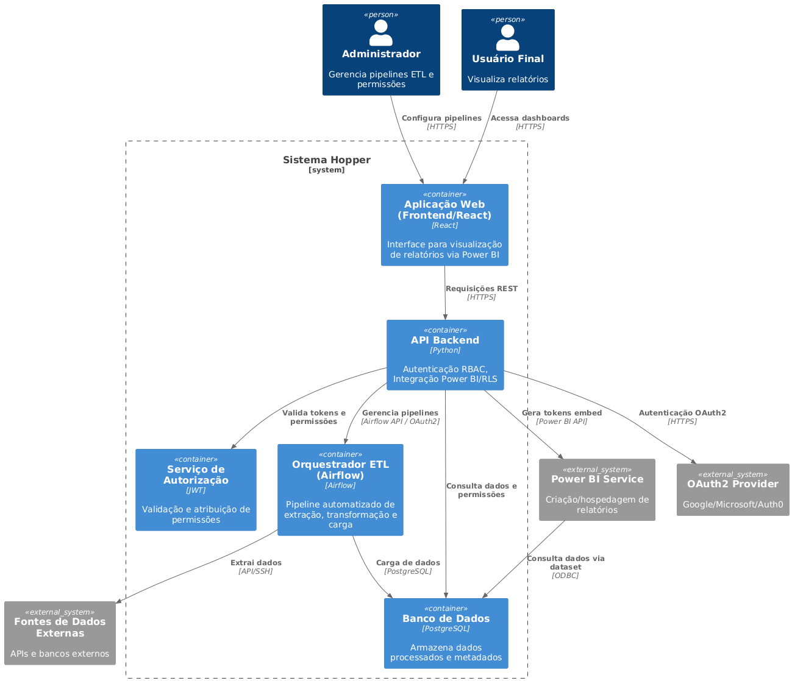

# Hopper

- **Título do Projeto**: Sistema de Gerenciamento e Distribuição de Relatórios Dinâmicos com Power BI Embedded.
- **Nome do Estudante**: Gabriel Deglmann Kasten.
- **Curso**: Engenharia de Software.
- **Data de Entrega**: [Data].

## Resumo

Este projeto visa desenvolver uma plataforma integrada para gerenciar processos de ETL (Extract, Transform, Load), relatórios dinâmicos no Power BI e distribuí-los de forma segura em uma aplicação web. O sistema utiliza do Airflow para orquestração de pipelines de dados, Power BI Embedded para disponibilização de dashboards e autenticação baseada em cargos (RBAC) e RLS (Row-Level Security) para controle de acesso.

## 1. Introdução

Organizações modernas demandam relatórios atualizados e personalizados para tomada de decisão. Entretanto, processos manuais de ETL e a distribuição não centralizada de relatórios geram gargalos de eficiência e riscos de segurança. Este projeto propõe uma solução automatizada para esses desafios.

A integração de ETL, ferramentas de BI e controle de acesso granular é essencial para a engenharia de software, envolvendo arquitetura de sistemas, segurança da informação e gestão de dados.

## 2. Descrição do Projeto

O Hopper é um Sistema de gerenciamento de dados e relatórios com Power BI Embedded, autenticação customizada e pipelines ETL automatizados. O sistema visa mitigar processos manuais de extração, transformação e carga de dados, falta de centralização no acesso a relatórios e garantir um controle adequado de permissões e visibilidade de dados.

Tendo em vista o tempo e conhecimento técnico, o sistema não abordará análise de dados em tempo real e não incluirá desenvolvimento de visualizações personalizadas fora do Power BI.

## 3. Especificação Técnica

### 3.1. Requisitos de Software

- **Lista de Requisitos Funcionais:**

  - **RF01: Execução automatizada de pipelines ETL com Airflow.**
    - Implementação:
      - Utilização de DAGs (Directed Acyclic Graphs) no Airflow para definir fluxos de trabalho.
      - Operadores customizados em Python para:
        - Extração de dados de origens heterogêneas (CSV, APIs REST, PostgreSQL).
        - Transformação com Pandas/Numpy para limpeza, enriquecimento e agregação de dados.
        - Carga incremental em tabelas do PostgreSQL usando psycopg2.
      - Sensores para monitorar disponibilidade de dados em diretórios ou APIs.
      - Gatilhos programados (diários/horários) e manuais via interface do Airflow.
      - Logs de execução e alertas por e-mail em caso de falhas.
  - **RF02: Geração de relatórios no Power BI com atualização programada.**
    - Implementação:
      - Conexão do Power BI Desktop ao PostgreSQL para criação de datasets
      - Uso da Power BI REST API para:
        - Atualização automática de datasets após conclusão do ETL.
        - Publicação de relatórios em workspaces dedicados.
      - Versionamento de relatórios via API para controle de mudanças.
  - **RF03: Autenticação de Usuários via RBAC.**
    - Implementação:
      - Backend em Golang (framework Gin) com endpoints REST para:
        - Registro de usuários (armazenamento em PostgreSQL com hash de senha bcrypt).
        - Login com geração de tokens JWT (JSON Web Tokens).
      - Definição de roles (Admin, Analista, Visualizador) no banco de dados.
      - Middleware de autorização para validar acesso a endpoints críticos.
      - Integração com OAuth2 para autenticação via Google/Microsoft.
  - **RF04: Aplicação de RLS conforme perfil do usuário.**
    - Implementação:
      - Definição de regras de segurança no Power BI usando DAX (ex: [Department] = USERNAME()).
      - Geração dinâmica de tokens de embed no backend Golang:
        - Mapeamento de usuários para grupos de segurança no Power BI Service via API.
        - Aplicação de filtros RLS baseados no cargo do usuário (ex: Gerente vê todos os dados, Analista vê apenas sua região).
      - Validação de permissões via claims do token JWT.
  - **RF05: Publicação de dashboards em uma aplicação web via Power BI Embedded.**
    - Implementação:
      - Frontend em React com biblioteca powerbi-client-react para embedar relatórios.
      - Componente dinâmico que:
        - Solicita token de acesso ao backend Golang (autenticado via JWT).
        - Renderiza relatórios em iframe com filtros contextuais (ex: data, região).
      - Controle de workspace via Power BI Embedded (Azure) para isolamento de ambientes (dev/prod).
    - **RF06: Monitoramento de Pipelines ETL.**
      - Implementação:
        - Implementação de um dashboard no Airflow com métricas de execução (taxa de sucesso/falha, tempo médio por task).
        - Integração do Airflow com Prometheus via Apache Airflow Exporter para coleta de métricas.
        - Visualização em tempo real no Grafana com alertas configurados para falhas críticas (ex: SLA ultrapassado).
        - Geração automática de relatórios semanais de desempenho via tarefa Airflow.
    - **RF07: Gerenciamento Self-Service de Relatórios.**
      - Implementação:
        - Desenvolvimento de uma interface React para administradores com drag-and-drop de arquivos .pbix.
        - Upload automático para o Power BI Service via Power BI REST API (endpoint /imports).
        - Associação de relatórios a grupos de segurança do Azure Active Directory (AAD) durante o upload.
        - Validação prévia de metadados do .pbix (ex: conexões de dados autorizadas).

- **Lista de Requisitos Não Funcionais:**

  - **RNF01: Tempo Máximo de 5 Minutos para Execução do ETL**
    - Estratégias:
      - Otimização de queries SQL com índices no PostgreSQL.
      - Uso de partições em DataFrames do Pandas para processamento em memória.
      - Paralelização de tarefas no Airflow.
      - Monitoramento via métricas do Airflow (DAG duration) e ajuste de recursos do contêiner Docker.
  - **RNF02: Disponibilidade de 99.9% para a Aplicação Web**
    - Estratégias:
      - Deploy na render.com com configuração de auto-scaling horizontal.
      - Health checks para reinicialização automática de contêineres.
      - Balanceamento de carga entre instâncias do backend Golang.
      - Uso de CDN para assets estáticos do React.
  - **RNF03: Criptografia de dados em trânsito e repouso.**
    - Estratégias:
      - TLS 1.3 para comunicação entre frontend/backend e APIs externas
      - Criptografia AES-256 no PostgreSQL para dados sensíveis (ex: PII).
      - Gerenciamento de segredos (chaves API, credenciais) via variáveis de ambiente no Docker.
  - **RNF04: Escalabilidade Horizontal do PostgreSQL.**
    - Estratégias:
      - Configuração de réplicas de leitura no PostgreSQL para descarregar consultas do Power BI.
      - Uso do PgBouncer no backend Golang para gerenciar pooling de conexões (máx. 200 conexões ativas).
      - Balanceamento de leituras entre réplicas usando lógica de read-only routing.
      - Monitoramento de desempenho via pg_stat_activity e ajuste dinâmico de réplicas.
  - **RNF05: Auditoria de Acesso.**
    - Estratégias:
      - Registro centralizado de logs no PostgreSQL (tabela audit_logs) com campos: user_id, endpoint, timestamp, status_code.
      - Rotina Airflow diária para exportar logs para AWS S3 em formato Parquet (compressão Snappy).
      - Política de retenção de 365 dias no S3 com transição para Glacier após 30 dias.
      - Consulta de logs via Athena para investigação de incidentes.

- **Representação dos Requisitos:**

### 3.2. Considerações de Design

- **Visão Inicial da Arquitetura**:
  - Camada ETL: Airflow para orquestração.
  - Camada de Dados: Banco de dados PostgreSQL e modelagem.
  - Camada de BI: Power BI para visualização dos dashboards.
  - Camada Web: ReactJS (frontend) e Golang (backend).

- **Padrões de Arquitetura**: MVC na camada web e Microserviços para ETL.

- **Modelo C4**:

### 3.3. Stack Tecnológica

- **Linguagens de Programação**:
  - Python (ETL),
  - JavaScript/React (frontend).
  - Golang (backend)

- **Frameworks e Bibliotecas**:
  - Apache Airflow,
  - React,
  - Gin (API)
  - Power BI REST API.
  - Pandas
  - Numpy
  - Psycopg2

- **Ferramentas de Desenvolvimento e Gestão de Projeto**:
  - Docker (conteinerização)
  - Git (versionamento)
  - Render (Deploy)

### 3.4. Considerações de Segurança

Análisando possíveis questões de segurança e como mitigá-las, foi decidido que como medida mínima de contenção, é necessário que os seguintes requisitos devem ser atendidos:

- Autenticação via OAuth2.
- RLS no Power BI para restrição de dados.
- Auditoria de logs de acesso.

## 4. Próximos Passos

Após aprovação do documento, os próximos passos são em ordem:

1. Criação de um backlog.
2. Implementação de um contâiner com Airflow e pipelines funcionais com diferentes peculiaridades.
3. Desenvolvimento de relatórios no Powerbi utilizando dos dados importados.
4. Desenvolvimento da interface web com integração ao Power BI Embedded.
5. Implementação de funcionalidades para ativação e desativação de cargas.
6. Permitir o gerenciamento facilitado das cargas, paineis, workspaces, grupos, RLS, etc.
7. Testes de segurança e carga.

## 5. Referências

Listagem das fontes de pesquisa, frameworks, bibliotecas e ferramentas que serão utilizadas.

- [Airflow Docs](https://airflow.apache.org/docs/)
- [PowerBI API](https://learn.microsoft.com/pt-br/rest/api/power-bi/)
- [WSTG](https://owasp.org/www-project-web-security-testing-guide/stable/)
- [Data Pipelines with Apache Airflow (Livro)](https://www.amazon.com.br/Data-Pipelines-Apache-Airflow-Harenslak/dp/1617296902)
- [Just the Docs (Documentação Geral)](https://just-the-docs.com/)
- [Plantuml (Diagramas)](https://plantuml.com/)
- [Docker](https://www.docker.com/)
- [React](https://react.dev/)
- [Pandas](https://pandas.pydata.org/)
- [Numpy](https://numpy.org/)
- [Psycopg2](https://pypi.org/project/psycopg2/)
- [Gin Gonic](https://gin-gonic.com/)
- [Render](https://render.com/)
- [Git](https://git-scm.com/)
- [Python](https://www.python.org/)
- [Golang](https://go.dev/)
- [Powerbi](https://www.microsoft.com/pt-br/power-platform/products/power-bi)
- [Powerbi Embedded](https://azure.microsoft.com/pt-br/products/power-bi-embedded)
- [Biblioteca de ícones](https://phosphoricons.com/)

Para controle de metas e entregas foi utilizado o [Trello](https://trello.com/).

## 6. Avaliações de Professores

- Considerações Professor/a:

- Considerações Professor/a:

- Considerações Professor/a:
